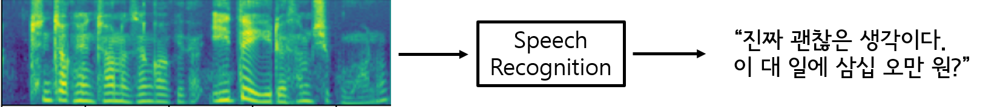

# tf2-speech-recognition-las
Tensorflow 2 Speech Recognition Code (CTC)

## Developers
* Younglo Lee (yllee@ispl.korea.ac.kr)

## Contents
  * [Contents](#contents)
  * [Speech Recognition](#speechrecognition)
  * [Features](#features)
  * [Prerequisites](#prerequisites)
  * [Examples](#examples)
  * [References](#references)
    
## Speech Recognition
- Tensorflow 2 implementation for korean speech recognition.
- Dataset can be downloaded in http://www.aihub.or.kr/aidata/105/download

## Features
- Connectionist Temporal Classification (CTC) speech recognition model
- Korean syllable tokenization

## Prerequisites
- Python 3.x
- Tensorflow 2.2.0
- Librosa 0.6.3
- etc.

## References and Resources
- https://github.com/Rayhane-mamah/Tacotron-2
- https://github.com/sooftware/KoSpeech (for train/test split csv)
